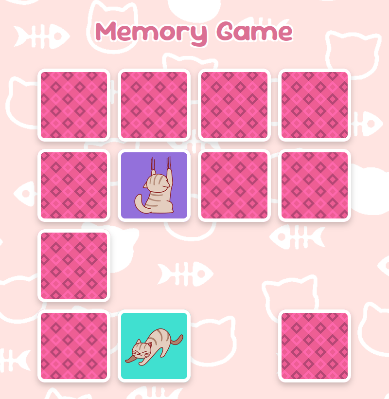

# Memory game

A small memory game made using React. You can [play here](https://memory-game-with-cats.vercel.app/).




## Credits

* [Amorlea (Erin)](https://amorlea.itch.io/pink-red-adorable-cat-stickers-1)
* [patbec](https://pixabay.com/vectors/cat-fish-pattern-cartoon-line-art-7180716/
)
* [Sunny_Mughal695](https://pixabay.com/es/vectors/antecedentes-patr%C3%B3n-geom%C3%A9trico-7245939/)


## Testing/Building

To test, in the project directory, you can run:

```
npm install
npm start
```

To create a build, run:

```
npm run build
```
